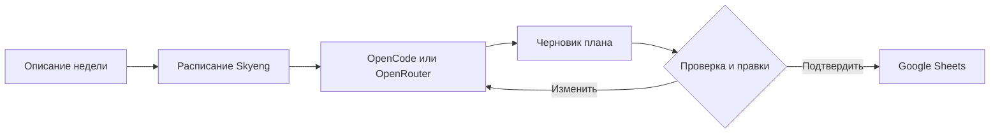

<div align="center">

# ✳ Авто-планирование

**Из свободных мыслей — в выполнимый план на неделю.**

Веб-приложение и Telegram-бот, которые помогают спланировать учебную неделю, учитывают расписание Skyeng и записывают подтверждённый план в персональную вкладку Google Sheets.

<p>
  <a href="#возможности">Возможности</a> ·
  <a href="#быстрый-старт">Быстрый старт</a> ·
  <a href="#как-это-работает">Как это работает</a> ·
  <a href="#диагностика">Диагностика</a>
</p>


</div>

---

## 🧭 О проекте

Пользователь описывает неделю обычным текстом: что нужно сделать, какие есть ограничения и сколько времени доступно. Внешняя LLM превращает это описание в структурированный черновик. Перед записью его можно отредактировать вручную или попросить ИИ внести правку.

Проект рассчитан прежде всего на веб-версию. Telegram-бот сохранён как альтернативный интерфейс.

## ✨ Возможности

- **Любая неделя** — в календаре можно выбрать любой день, а приложение само определит неделю с понедельника по воскресенье.
- **Расписание Skyeng** — названия активностей, даты и время подтягиваются автоматически.
- **Правильная семантика Skyeng** — уроки, практики, тренажёры и тесты считаются заданиями в ЛК; вебинары и практика с наставником считаются вебинарами.
- **Черновик перед записью** — цели и задачи можно менять в простом редакторе.
- **Балансировка недели** — модель учитывает доступную нагрузку, а приложение предупреждает о перегруженных днях и дубликатах.
- **Drag-and-drop** — задачи можно перетаскивать между днями прямо в редакторе черновика.
- **Перенос хвостов** — незавершённые задачи можно быстро перенести на следующую неделю.
- **Рефлексия** — после записи план можно автоматически сверить со статусами в Sheets и заполнить колонку «Рефлексия».
- **Правки обычным текстом** — например: «перенеси тренировку на субботу и добавь 90 минут».
- **Аккаунты** — регистрация проходит через одобрение администратора, а профиль хранит лист, ответы на вопросы и настройки расписания.
- **Персональная вкладка** — лист находится по ФИО в названии вкладки Google Sheets.
- **Предупреждения** — приложение подсвечивает перегруженные дни, большое количество сфер и задачи без времени.
- **Совместимый формат таблицы** — `Неделя | Цели недели | Сфера | Задача | День | Статус | Рефлексия`.

## 🔁 Как это работает



## 🛠 Стек

- **Backend:** Python, FastAPI, Uvicorn
- **LLM:** OpenCode CLI с бесплатными моделями или OpenRouter через OpenAI-compatible API
- **Расписание:** Skyeng Avatar API + Playwright для авторизации
- **Хранилище:** SQLite для сессий и кэша расписания
- **Таблица:** Google Sheets API и service account
- **Frontend:** HTML, CSS и vanilla JavaScript
- **Telegram:** aiogram 3

## 🚀 Быстрый старт

### 1. Скачать проект

```bash
git clone https://github.com/venchik111/auto-plan-sinhub-bot.git
cd auto-plan-sinhub-bot
```

### 2. Создать окружение и установить зависимости

```bash
python3 -m venv .venv
source .venv/bin/activate
pip install -r requirements.txt
```

Для входа в Skyeng нужен Chromium. Проверь, что он установлен и доступен по `/usr/bin/chromium`, либо задай другой путь через переменную `BROWSER_EXECUTABLE`.

### 3. Настроить переменные окружения

```bash
cp .env.example .env
```

Минимально проверь в `.env`:

| Переменная | Назначение |
| --- | --- |
| `LLM_PROVIDER` | `opencode` или `openrouter` |
| `OPENCODE_MODELS` | Список моделей OpenCode через запятую |
| `GOOGLE_SPREADSHEET_ID` | ID таблицы из её URL |
| `GOOGLE_SERVICE_ACCOUNT_FILE` | Путь к JSON-ключу service account |
| `SKYENG_STORAGE_STATE_FILE` | Путь к сохранённой сессии Skyeng |
| `DATABASE_PATH` | Путь к локальной SQLite-базе |
| `APP_TIMEZONE` | Часовой пояс, по умолчанию `Europe/Moscow` |
| `ADMIN_PASSWORD` | Пароль страницы `/admin` для одобрения аккаунтов |

> ⚠️ Никогда не добавляй в GitHub `.env`, JSON-ключ Google, cookies Skyeng, базу данных или логи. Эти пути уже включены в `.gitignore`.

## 🤖 Подключение LLM

### OpenCode — основной вариант

```bash
npm install -g opencode-ai
opencode providers login
```

В `.env` оставь:

```dotenv
LLM_PROVIDER=opencode
OPENCODE_AGENT=planner
OPENCODE_MODELS=opencode/muse-spark-1.3-contributor-free,opencode/mimo-v2.5-free
```

OpenCode запускается как отдельный CLI-процесс. Конфигурация агента находится в `opencode/opencode.json`. Доступность бесплатных моделей зависит от текущего состояния OpenCode.

### OpenRouter — запасной вариант

```dotenv
LLM_PROVIDER=openrouter
OPENROUTER_API_KEY=твой_ключ
OPENROUTER_MODEL=openrouter/free
OPENROUTER_BASE_URL=https://openrouter.ai/api/v1
```

## 📊 Подключение Google Sheets

1. Создай проект в Google Cloud Console.
2. Включи **Google Sheets API**.
3. Создай service account и скачай JSON-ключ.
4. Положи ключ, например, в `credentials/service-account.json`.
5. Открой таблицу и выдай email service account роль **Редактор**.
6. Укажи ID таблицы в `GOOGLE_SPREADSHEET_ID`.

Одной публичной ссылки на таблицу недостаточно: для записи нужен именно доступ service account.

## 📅 Подключение Skyeng

Запусти веб-версию и нажми **«подключить»** рядом с расписанием:

```bash
./start-site.sh
```

Открой [http://localhost:8000](http://localhost:8000), введи ФИО ровно как в названии вкладки Google Sheets и пройди вход в открывшемся окне Skyeng.

Для управления сайтом:

```bash
./start-site.sh          # запустить и открыть сайт
./start-site.sh status   # проверить состояние
./start-site.sh logs     # смотреть логи
./start-site.sh restart  # перезапустить
./start-site.sh stop     # остановить
```

Новый пользователь сначала создаёт аккаунт и указывает ФИО вкладки. Заявка появляется на странице [http://localhost:8000/admin](http://localhost:8000/admin); после одобрения студент может войти. Если `ADMIN_PASSWORD` не задан, для локальной совместимости используется `CURATOR_PASSWORD`.

Сессия сохраняется отдельно для текущей веб-сессии. Расписание кэшируется на неделю, но при выборе другой недели загружается отдельный диапазон дат.

> В текущей локальной версии авторизация Skyeng открывает окно Chromium на той машине, где запущено приложение. Для публичного облачного деплоя этот процесс нужно адаптировать под headless-авторизацию или безопасную передачу состояния браузера.

## 🖥 Запуск

### Веб-приложение

```bash
./.venv/bin/uvicorn app.web:app --host 0.0.0.0 --port 8000
```

Проверка доступности:

```bash
curl http://localhost:8000/api/health
```

Ожидаемый ответ:

```json
{"status":"ok"}
```

### Telegram-бот

Для Telegram дополнительно задай `TELEGRAM_BOT_TOKEN` в `.env` и выполни:

```bash
./.venv/bin/python -m app.main
```

## 📝 Сценарий использования

1. Выбери любую неделю календарём.
2. Подключи вкладку Google Sheets по ФИО.
3. При необходимости подключи расписание Skyeng.
4. Опиши планы своими словами или воспользуйся наводящими вопросами.
5. Проверь черновик целей и задач.
6. Внеси ручные или текстовые правки.
7. Нажми **«Подтвердить и записать»**.

Пример описания:

```text
На следующую неделю хочу закрыть долг по физике: в понедельник разобрать конспект,
во вторник решить задачи и в пятницу пересдать тест. Ещё две тренировки в среду и субботу.
На каждую учебную задачу примерно по часу, тренировка полтора часа.
```

## 📁 Структура проекта

```text
app/
├── web.py              # FastAPI-приложение и API веб-версии
├── bot.py              # Telegram-сценарии
├── llm.py              # OpenCode/OpenRouter и системный промпт
├── skyeng.py           # Получение и разбор расписания
├── skyeng_login.py     # Локальная авторизация Skyeng через Playwright
├── sheets.py           # Поиск вкладки и запись плана в Google Sheets
├── database.py         # SQLite-сессии и кэш расписания
├── models.py           # Модели плана и валидация
└── weeks.py            # Работа с календарными неделями
web/
├── index.html          # Разметка веб-интерфейса
└── static/             # CSS и JavaScript
opencode/
└── opencode.json       # Ограничения и агент planner
tests/                  # Тесты парсера, моделей и Google Sheets
```

## 🧪 Проверка

```bash
PYTHONPATH=. ./.venv/bin/python -m pytest -q
PYTHONPATH=. ./.venv/bin/python -m compileall -q app
node --check web/static/app.js
```

## 🩺 Диагностика

| Симптом | Что проверить |
| --- | --- |
| `Google Sheets API: HTTP 403` | Таблица расшарена на email service account с ролью **Редактор** |
| `Skyeng вернул HTTP 401/403` | Подключи Skyeng заново — cookies могли устареть |
| `Не найден браузер` | Установи Chromium или задай `BROWSER_EXECUTABLE` |
| OpenCode не собирает план | Проверь `opencode providers login`, модель и логи приложения |
| План не создаётся | В описании должна быть конкретика: действие, день или срок и хотя бы немного деталей |

## 🔐 Безопасность

Проект работает с чувствительными данными: API-ключами, Google credentials и cookies Skyeng.

- не публикуй `.env` и содержимое `credentials/`;
- не вставляй токены в README, issue или публичные логи;
- при утечке ключа сразу отзови его и создай новый;
- для публичного запуска добавь HTTPS, авторизацию пользователей и постоянное защищённое хранилище.

## 📄 Лицензия

Лицензия пока не добавлена. Условия использования кода не определены.
